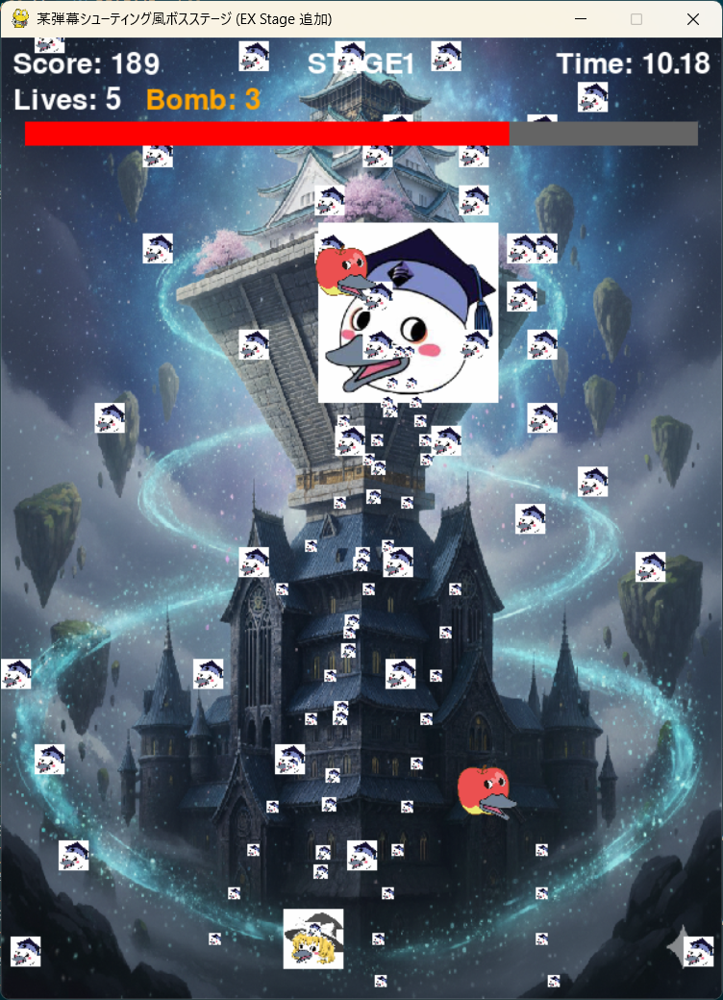

# 工科Project

## 実行環境の必要条件
* python >= 3.10
* pygame >= 2.5.0

## ゲームの概要
* 本作は、某弾幕シューティングゲームをオマージュしたボス戦特化型のゲームです。
* プレイヤーは自機を操作し、自動発射されるホーミング弾でボスを攻撃します。ボスの弾幕にかする（GRAZE）ことでスコアがアップします。ボスは3種類のステージ（スキル）を持っており、HPを削り切ることで次のステージへ移行します。
* 初期残機は10機で、これが無くなるとゲームオーバーとなります。全ステージをクリアすると、各ステージのクリアタイムと総合タイムが表示されます。

## ゲームの遊び方
### 操作方法
* W, A, S, D  自機の移動（上、左、下、右）
* 左SHIFT  低速移動（移動速度が低下します）
* TAB  ボムの使用（後述）
* 上下矢印キー  難易度選択
* SPACE/ENTER  難易度決定 / 復活（被弾後） / ゲーム終了（リザルト・ゲームオーバー時）
* SPECE/ENTER  難易度決定
* ESC  （プレイ中）難易度選択画面に戻ります
* 左CTRL  （通常クリア後のリザルト画面）EXステージへ突入

### 難易度選択
* ゲーム開始時に「EASY」「NORMAL」「HARD」の3種類から難易度を選択します。難易度によって自機の残機、ボスの体力、弾幕の内容が変化します。

### 残機と被弾
* 自機の当たり判定は、中央の小さな矩形（hitbox）です。
* 敵の弾に被弾すると残機が1減り、画面上の全ての敵弾が消去されます。
* 被弾後、自機は一定時間（10秒）操作不能の無敵状態となります。この待機時間中に SPACEキー を押すことで、即座に復活し操作可能になります。
* 残機が0の状態で被弾すると「GAME OVER」となります。

### ボム（BombArea）
* TABキーで使用可能です。
* 使用すると一定時間、自機を中心に橙色の円陣が展開され、触れた敵弾を消去します。

### パワーアップ（PowerItem）
* ゲーム中、定期的にパワーアップアイテムが出現します。
* 一定数アイテムを取得すると自機がパワーアップし、射撃ダメージが増加します。

### EXステージ
* 通常ステージ（STAGE 1〜3）をクリアした後、リザルト画面で左CTRLキーを押すことで突入できる高難易度の隠しステージです。

### スコアアップ方法
#### スコアは以下の行動で加算されます。
* ボスへの攻撃: 自機弾がボスにヒットします。
* GRAZE（かすり）: 敵弾が自機の当たり判定（hitbox）を避け、その周囲にあるgrazeboxを通過します。
* 敵弾の回避: 敵弾を撃破せず、画面外に到達させます。
* ボムでの敵弾消去: ボムで敵弾を消去します。

### 終了条件
#### 以下のいずれかの条件でゲームが終了します。
* ゲームオーバー: 残機が0の時に被弾します。
* 通常クリア: STAGE3をクリアし、リザルト画面でSPACEキーまたはENTERキーを押します。
* EXクリア: EXステージをクリアし、EXリザルト画面で左CTRLキーを押します。

## ゲームの実装

### 共通基本機能
* Pygameのウィンドウ表示、ゲームループの構築
* 自機クラス（Player）
    * WASDによる移動
    * ホーミング弾の自動発射
    * 当たり判定（Hitbox） と かすり判定（Grazebox） の実装
    * 被弾処理、残機制（10機）、復活処理（10秒 or SPACEキー）
* ボスクラス（Boss）
    * 3種類のスキル（ステージ）の実装（HP: 100, 150, 200 ※NORMAL基準）
    * ステージ移行処理（HPゼロ）
    * ボスのランダム移動
    * 撃破時間の計測とタイムの記録
* 弾クラス（Bullet）
    * 自機ホーミング弾
    * 敵弾4種＋α（小弾、大弾、細レーザー、置きレーザー、特大弾（EXのみ））
    * 置きレーザーの予兆表示（半透明）と判定の遅延
* 基本的なUI（スコア、残機、ボスHP、スキル名、経過時間）
* スコアリング（ダメージ、弾避け、GRAZE）
* ゲームオーバー処理、リザルト画面（クリアタイム表示）
* SPACEキー押下によるゲーム終了（ゲームオーバー・リザルト画面）

### 分担追加機能
* **（担当:島崎 虎太郎）** Shiftキー押下による自機キャラのスピードダウン機能＋EX含めた各難易度ごとの背景とBGM
* **（担当:中村 友翔）** ボム機能（使用で敵の弾幕を一定期間一定範囲消滅させる）
* **（担当:鈴木 遥也）** アイテムドロップと自機パワーアップ機能
* **（担当:西野 海音）** 難易度3種（EASY,NOMAL, HARD）の実装
* **（担当:天海 夕羽）** ボス撃破後の特定コマンドによるEXステージ機能及びその内容

### ToDo
* ゲームバランスの調整
* 画像の差し替え（弾幕など）
* 各難易度ごとに背景画像、BGMの設定
* EXSTAGEにおけるHP調整
* ラグの解消

### メモ
* 追加機能はできるかぎり多くの機能をclass内のみで完結できるように設定している。
* 画像がなかった場合は四角い色付きsurfaceが表示されるようになっている。